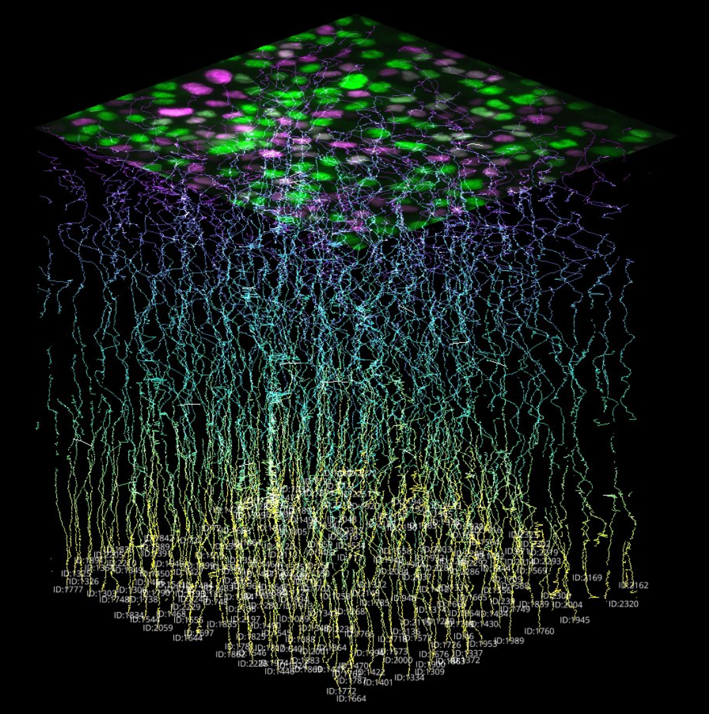

# segment-classify-track

Image: 3D (x,y,t) rendering of single-cell tracks belonging to a competitive MDCK epithelium.

This repository contains all the steps necessary for the annotation and tracking of a homogenous or heterogenous population of epithelial cells in time lapse microscopy data.

Each step has an associated Jupyter notebook which should be run in the following sequential order:

1. Image alignment (align.ipynb)
2. Cellular segmentation (cellpose_segmentation.ipynb/stardist_segmentation.ipynb)
3. Phenotype classification (cellx_classify.ipynb)
4. Object tracking (btrack_tracking.ipynb)
5. Viewer (napari_viewer.ipynb)

The repository is designed to work with the raw output of any timelapse microscopy data set that is structured with the following path pattern:

`/expt_ID/PosID/img_channel000_position000_time000000000_z000.tif/`

i.e. `Nathan/ND0000/Pos0/Pos0_aligned/img_channel000_position...z000.tif`

This pipeline was originally designed to label a 2-class, mixed population cell competition images (a wild-type cell versus a mutant), but now has been modified to be more broadly applicable to a homogenous population of cell types, with the 2-class pipeline in a separate subdirectory.

Image loading is done via the DaskOctopusLiteLoader function from https://github.com/lowe-lab-ucl/octopuslite-reader
